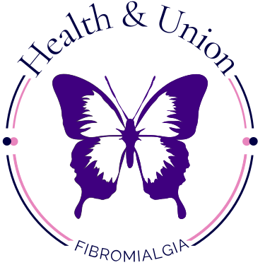
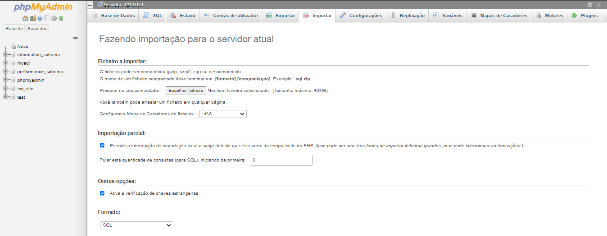
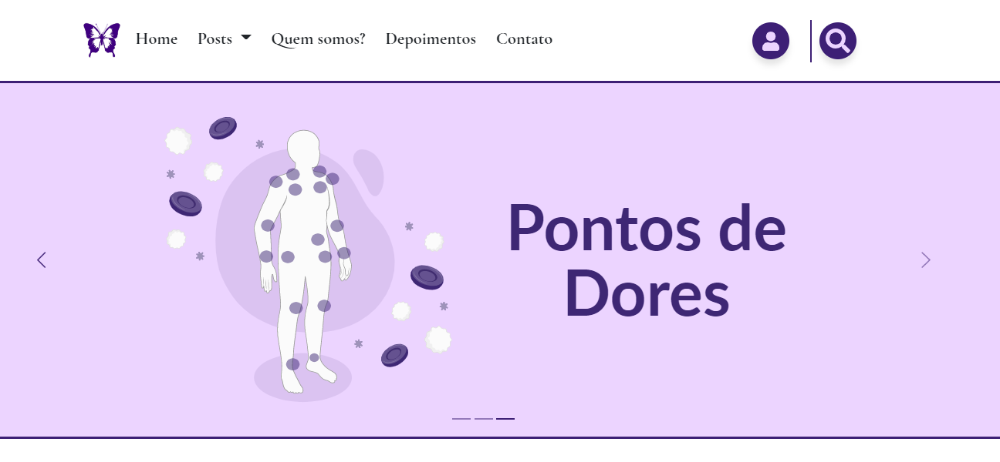
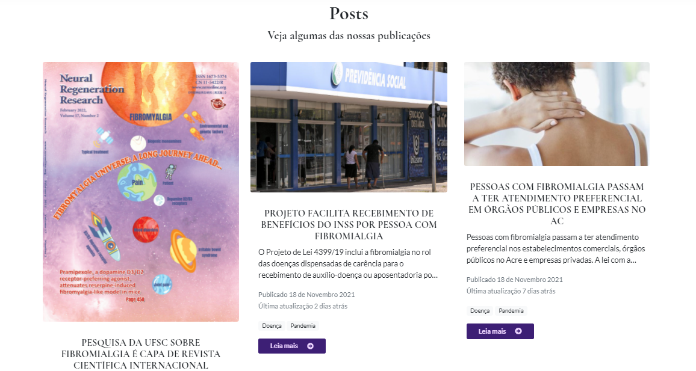
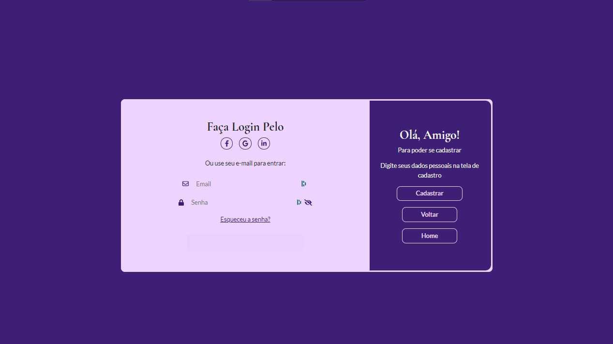
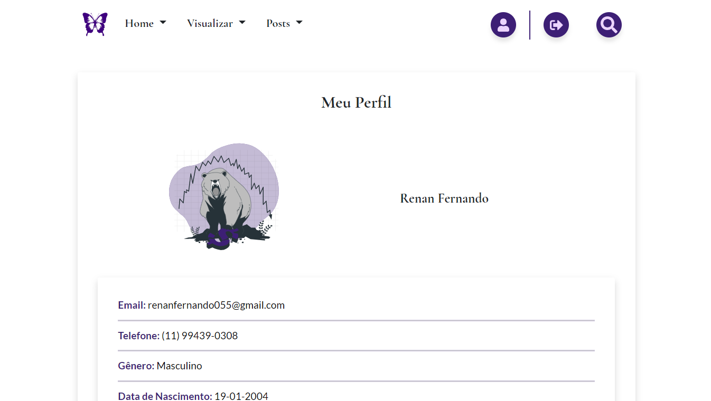
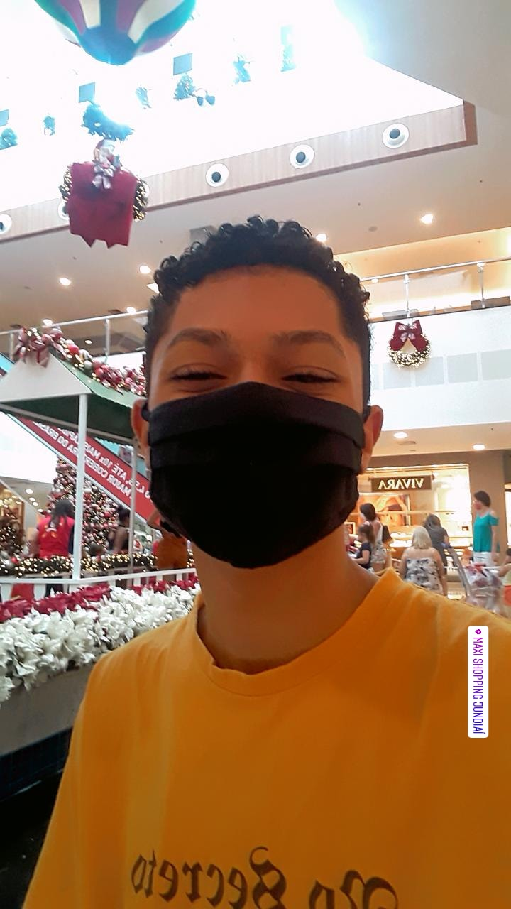

<h1 id="health&Union" style="text-align: center"><strong>Health & Union</strong></h1>

<strong>Seu site especializado em informação sobre Fibromialgia</strong>

---

<h4 align="center"><strong>Status:</strong> Health & Union está concluído ✔ </h4>

---

<h2>🔗 Tabela de Conteúdos</h2>

<ul>
    <li><a href="#quemSomos">Quem Somos?</a></li>
    <li><a href="#proposito">Propósito do Site</a></li>
    <li><a href="#tecnologias">Tecnologias</a></li>
    <li><a href="#features">Features</a></li>
    <li><a href="#screenshots">Screenshots</a></li>
    <li><a href="#bancoDados">Banco de Dados</a></li>
    <li></li>
    <li><a href="#autor">Autor</a></li>
    <li><a href="#licenca">Licença</a></li>
</ul>

<h2 id="quemSomos">🕶 Quem somos?</h2>

O <strong><i>Health & Union</i></strong> consiste em um site de apoio, comunicação e transporte de informação para pessoas que apresentam a Fibromialgia e para todo aquele que procura ter mais conhecimento sobre o assunto. Mediante à uma patologia muitas vezes desmoralizada, o <strong><i>H&U</i></strong> pretende criar um laço acolhedor de união para que essas pessoas não se sintam incompreendidas e isoladas da sociedade, proporcionando atualizações e resultados de pesquisas sobre a fibromialgia, mantendo uma comunicação não só entre os pacientes como também entres médicos e pesquisadores.

<h2 id="proposito">🕹 Propósito do Projeto</h2>

O site Health & Union foi desenvolvido mediante ao Trabalho de Conclusão de Curso apresentado ao Curso Técnico em Informática para internet da Etec de Campo Limpo Paulista, orientado pelo Prof. Marcelo Macrino Dos Santos, como requisito parcial para obtenção do título de técnico em Informática para internet.

<h2 id="tecnologias">💻 Tecnologias Utilizadas</h2>

 
    
    
  
  
  
  

<h2 id="features">📝 Features</h2>

<ul>
    <li>Cadastro de usuários</li>
    <li>Cadastro de posts</li>
</ul>

<h2 id="bancoDados">🎲 Banco de Dados</h2>

<ul>
    <li>
Utilizando o phpmyadmin do <a href="https://www.apachefriends.org/pt_br/index.html">Xampp</a>, crie um novo banco de dados com o nome "tcc_site"; no menu, clique em "importar" e importe o arquivo <a href="tcc_site.sql">tcc_site.sql</a>.
</li>
    
    <li>
<strong>Obs:</strong> Em caso de dúvida de como importar, <a href="https://www.youtube.com/watch?v=mFI88qPAdJI">clique aqui</a> para ver um tutorial.
</li>
</ul>

<h2 id="screenshots">📷 Screenshots do Site</h2>

<h2 id="colaboradores">🤝 Colaboradores</h2>

Agradecemos às seguintes pessoas que contribuíram para este projeto:

<table style="display: flex; justify-content: center !important;">
  <tr>
    <td align="center">
      <a href="https://www.instagram.com/elxsw_/">
         
        
          <b>Elisa Zerbinatto</b>
        
      </a>
    </td>
    <td align="center">
      <a href="https://www.instagram.com/h.souzc/">
         
        
          <b>Heloiza Cunha Souza</b>
        
      </a>
    </td>
  </tr>
</table>

<h2 id="autor">👨‍💻 Autor</h2>
<a style="display: flex; align-items: center; margin-bottom: 1rem;" href="https://https://github.com/devRenanFernando">

 <strong>Renan Fernando - Web Developer</strong> 

</a>

 
  
  
  

<h2 id="licenca">📝 Licença</h2>

Esse projeto está sob licença. Veja o arquivo <a href="LICENSE.md">Licença</a> para mais detalhes.

[⬆ Voltar ao topo](#health&Union)
